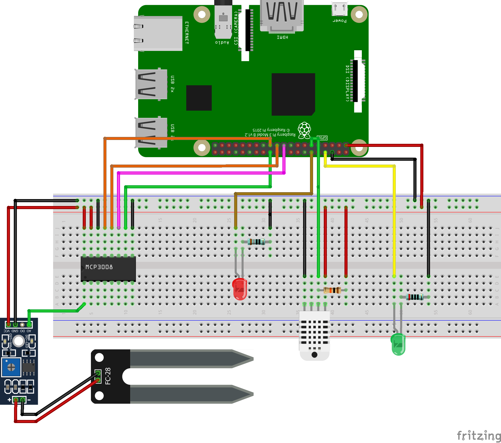
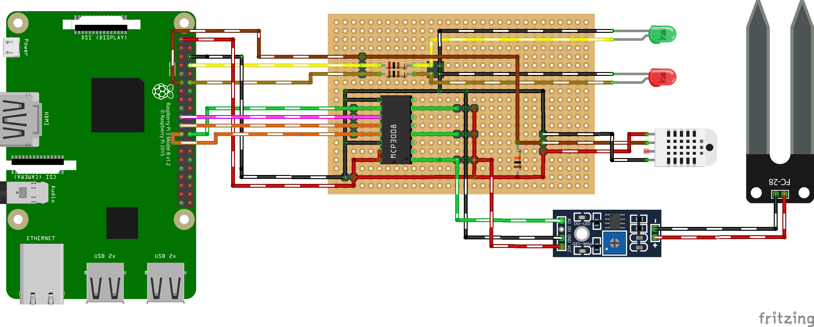

# greenhouse-client
This repository contains code and documentation for a raspberry device that can measure humidity and temperature.

Contents:
 - Documentation for the hardware setup
 - ansible: Raspberry configuration that reduces power consumption to a minimum
 - src: Golang code which collects data from sensor and sends it to a server side API in regular intervals

The server side counterpart can be found here (soon):
https://github.com/ytsworld/greenhouse-receiver

## Hardware
- Raspberry Pi 3 
- DHT-22 temperature / air humidity sensor
- YL-38 + YL-69 soil moisture sensor
- IC MCP3008 analog/digital converter
- LED
- 10kΩ resistor (pull up for DHT-22)
- 200Ω resistor (depends on led)


Raspberry can only read digital input.
To read the analog signal of the soil moisture sensor the MCP3008 converter is connected to the SPI interface.
The IC can convert data from up to eight individual channels.
DHT22 temperature sensor provides digital data but requires a pull-up resistor on the data pin.
The led is used as indicator when a measurement is in progress.



## Raspberry setup
This step is a set of recommendations & ideas how to setup raspberry automatically with ansible.
Some of these steps might not be feasible for everyone and need adoption (e.g. German keyboard layout ;-) )

Make sure to have a fresh installation of [Raspbian Buster](https://www.raspberrypi.org/downloads/raspbian/) on your device (Lite is perfect but other variants should work too).
Copy `inventory.tmpl` to `inventory` and fill the template with required values for your raspberry device.
Note that I'm using two devices, one for testing and the other with a 'production' setup.
If you have only one device use the `dev` setup as it contains everything to build and run the code.

Start and enable ssh server so ansible can connect and manage the device:
```sh
passwd pi # Change password for pi user before ssh daemon is started
sudo systemctl enable ssh
sudo systemctl start ssh
```
Don't forget to update your `inventory` file with the new password.

On a Linux device (or Windows 10 + Linux subsystem + Docker desktop) ansible can be triggered using these commands from the repository root directory:
```
./scripts/startAnsible.sh ./ansible/base-setup.yml
./scripts/startAnsible.sh ./ansible/greenhouse.yml
```

## Build 
Golang provides a feature to cross compile code; sadly this does not work when "C" comes into play which is the case for this project.
So the build is done on raspberry. Make sure you have a `dev_device=true` prepared by ansible before executing the build:
```
export PI_DEV_IP=192.168.xxx.xxx
./scripts/trigger_build.sh
```
After executing the `greenhouse-client` binary should be present in the root directory of this repository clone.
It will be rolled out via ansible on devices configured with `prod_device=true`.

## Notes

### Power consumption
Production devices have the script [reducePowerConsumption.sh](ansible/resources/greenhouse/home/pi/reducePowerConsumption.sh) added to crontab to run on boot.
Some minutes after boot this script will power off USB ports and HDMI output.
After the script succeeded, power consumption is down to ~1.5 Watt.
In my setup the raspberry device is connected to a 12 Volt Battery and a 50W solar panel so it never runs out of juice even during winter.

To debug what happens on the device connect using ssh and run `~./cancelPowerConsumption.sh` before the power reduction is done.

### Further reading

__Raspberry PI GPIO__
https://www.raspberrypi.org/documentation/usage/gpio/

__Temperature and Humidity sensor__

https://pimylifeup.com/raspberry-pi-humidity-sensor-dht22/

__Soil moisture sensor__

https://tutorials-raspberrypi.com/measuring-soil-moisture-with-raspberry-pi/

__Ansible__
https://docs.ansible.com/ansible/latest/network/getting_started/first_playbook.html


## TODO

A list of features that might be added in future:
- [ ] Automated watering (e.g. by using a magnetic valve)
- [ ] Automated window opening (e.g. by using a stepper motor)
